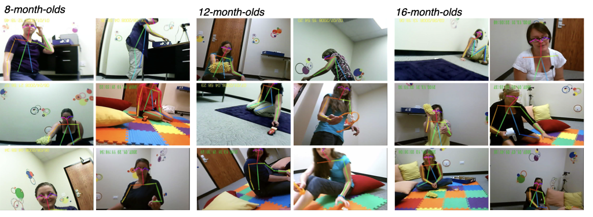
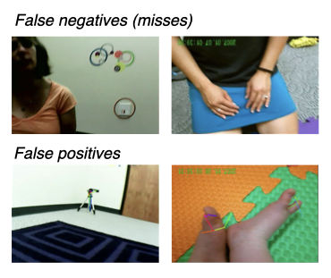

```{r, libraries include=FALSE}
library(knitr)
knitr::opts_chunk$set(fig.crop = FALSE, 
                      fig.path='figs/', echo=FALSE, warning = FALSE, 
                      cache=FALSE, message = FALSE, sanitize = TRUE)

library(here)
library(readr)
library(dplyr)
library(tidyr)
library(xtable)
library(lubridate)
library(langcog)
library(ggplot2)
library(ggthemes)
library(lme4)
library(gridExtra)
library(assertthat)
library(tidyverse)
library(viridis)
library(papaja)
library(png)
library(magick)
library(lmerTest)
```

```{r} 
## Sources critical functions for merging data files amd timestamps
source("../analysis/1_merge_data/helper.R")
```

```{r}
## Cosmetic rendering functions/settings
# base_size in theme_few (changes font size in plots)
plot_size=16


reportP <- function(pValue){
  if (pValue < 0.001){
    result <- "P < 0.001"
  } else {
    result <- sprintf("P = %.3f", pValue) # inserts a float into a string and simultaneously do rounding
  }
  return(result)
}
```

From their earliest months, infants are deeply engaged in learning from others. Even newborns tend to prefer to look at faces with direct vs. averted gaze [@farroni2002eye] and young infants follow overt gaze shifts [@gredeback2010development; @bruner1975]. And as infants reach their first birthday, they also tend to follow [@yu2013joint; @yu2017hand] and imitate the gestures of their caregivers (e.g., pointing). Infants' ability to process these social cues may provide strong scaffolding for early word learning. Longitudinal studies provide some evidence for this link: children’s level of joint engagement with their mother at 9-12 months predicts both their receptive and productive vocabularies [@carpenter1998] and 10 month-olds who follow an adult’s gaze (in an experimental context) have larger vocabularies at 18 months and throughout the second year of life [@brooks2005; @brooks2008]. While the relationship between hand-following and language development has been less well characterized, infants who follow their caregivers’ hands tend to be those who spend more time jointly attending to events with their caregivers [@yu2017hand] and caregivers tend to create referential clarity by holding objects for their infants to see [@suanda2019signal].

Relatively little work, however, has quantified how often infants see and use these kinds of social cues in naturalistic learning environments. By using head-mounted cameras to record what infants see, researchers have begun to document the infant egocentric perspective [@yoshida2008] and to quantify the information -- social and otherwise -- available to infants as they learn. While head-mounted camera data do not provide explicit information about what infants are looking at (unlike head-mounted eye-trackers), some work suggests that infants orient their head towards what they are focusing on -- putting those people or objects in view [@yoshida2008]. Initial recordings using this technique during in-lab play sessions revealed a different view than many imagined: instead of being dominated by faces, the infant perspective contained close up views of primarily toys and hands [@yoshida2008; @franchak2011; @yu2017hand]. Subsequent research has revealed that the infant view undergoes dramatic changes as infants grow. Recordings from home environments suggest that the viewpoints of very young infants -- less than 4 months of age -- do indeed contain persistent and frequent views of faces [@fausey2016; @jayaraman2017faces] but that the infant view tends to contain more and more hands as infants grow older. 

Broadly, the field is in need of computational tools to reuse these rich video datasets and understand the generalizability of findings across populations, tasks, and age-ranges and to understand how changes in the infant view are influenced by other aspects of development. For example, children’s evolving motoric abilities likely change how they participate with their caregivers in different kinds of play sessions (e.g., exploring novel environments vs. playing with novel objects) which in turn may shape the social cues that children see and use during learning. Yet while the field has assembled many head-mounted camera datasets, conducting new analyses on these videos has remained prohibitively time-consuming due to a lack of computational tools for annotations. Instead, hundreds of hours of manual annotations have been required to analyze a fraction of the available frames for a given analysis. Thus, despite containing a wealth of information about the structure of parent-child interactions, these datasets have thus gone dramatically underused. As a result, an understanding of the nuanced relationship between the social information in the infant view and children’s motoric and linguistic development has remained challenging. 

Indeed, developmental changes in the infant view are likely the downstream consequence of myriad factors, including infants’ evolving locomotive abilities: an infant’s ability to sit, crawl, stand, or walk structures the way they interact with the things and people in their world. These motoric developments have been thought of as gateways that open up entirely new phases of development [@iverson2010] causing a cascade of changes in an infant’s ability to interact with their world and the people in it [@karasik2014].  

Thus, one idea is that infants’ changing locomotor abilities could shape the social cues that infants see and seek out, in turn impacting their cognitive and linguistic abilities. Some evidence supports this view: for example, infants’ experience with sitting predicts their success at 3D object completion tasks [@soska2010systems] as well as their receptive vocabulary [@libertus2016sit], suggesting the importance of focused play sessions for language development.  Later, as children begin crawling [@adolph1998learning] – or scooting or cruising [@patrick2012developmental] – their view of the world changes as they are no longer constrained to the same spot that their caregivers last placed them in. Yet while crawlers can choose where to go and what they see to a much greater degree, they also appear to spend much of their time in a world populated by floors and knees; during spontaneous play, toddlers are more likely to look at the floor while crawling than while walking [@franchak2011],, when they have full visual access to their environment and the people in it [@kretch2014]. 	

On one theoretical view, it is primarily children’s ability to stand and walk that fundamentally changes their ability to access social information (e.g., facial expressions, gaze cues, pointing) relative to children who are still crawling and sitting, which could in turn allow infants to learn words quicker and more efficiently [@walle2016infant]. Supporting this idea, walking vs. crawling infants tend to make different kinds of object-related bids for attention from their caregivers [@karasik2014], hear more action directed statements (e.g., “open it”) [@karasik2014], and have higher receptive and productive vocabularies [@walle2014]. However, not all evidence supports this view: parental report data suggest no relationship between walking and the onset of language [@moore2019point]. Further, using head-mounted eye-tracking data from one-year-olds, Franchak et al., 2018 found that infants’ in-the-moment posture also interacts with their caregivers’ posture to shape the social information in view [@franchak2018see], highlighting the need to consider not only children’s motoric abilities but how caregivers adapt to them. 

Recent innovations in computer vision hold promise for understanding the generality of these findings. By automating annotations of the infant view, we can go beyond limited sets of manual annotations to characterize the consistency and variability in the social information that children see during early learning. Over the past decade, deep neural networks have become dramatically better at a wide range of visual tasks, including object classification [@simonyan2014very] scene categorization [@zhou2017places], and pose detection [@zhang2016], arguably facilitating our understanding of visual perception [@peterson2018evaluating; @vanrullen2017perception] and improving computational neuroscience [@kietzmann2018deep]. Yet as most models have been trained on photographs or videos taken from the adult perspective, it is unclear how easily these models can be applied to videos taken from the infant perspective. While some computer vision algorithms have indeed been adapted for egocentric vision (e.g., gaze predictions, [@zhang2018coarse]), very few have been adapted for egocentric video data from infants [@bambach2015lending].

Here, we make progress on understanding the social information in the changing infant view by adapting novel computational methods. We use a publicly available pose detection model [@cao2017realtime; @zhang2016]) for the detection of faces and hands in infant egocentric video data, a similar approach to that used by @long2020detecting.  We compare the detection accuracy of this method with that of both older and more specialized models of face detection, demonstrating the usability of this off-the-shelf model for quantifying the faces and hands in the infant view in egocentric video datasets.

We then use these automated detections to examine how the social information in view changes with respect to infant’s age and real-time posture in two different egocentric video datasets.  In Study 1, we use the cross-sectional design of our dataset to examine the relative contributions of children’s age vs. real-time posture on infants’ visual access to social information, and use the transcriptions to explore how the availability of social cues changes relative to naming events (e.g., “Yes, you like the [ball!]”).  Indeed, despite positing links between the social information in view and language development, no work to date has directly examined how the availability of social information changes around naming events in naturalistic contexts. In Study 2, we apply this same automated method to @franchak2018see, where one-year-olds wore head-mounted eye-tracking cameras during a play session and their in-the-moment posture was hand-annotated (https://nyu.databrary.org/volume/135). Unlike in Study 1, infants and caregivers roamed a large, open playroom and explored different toys placed throughout. We analyze this second dataset with the goal of validating our automated method on a very different kind of video dataset, extending their primary findings originally obtained with a head-mounted eye-tracker. Across both datasets, we predicted that there would be differential access to social information based on children’s postural developments in both datasets: crawling infants would see fewer faces/hands because they would primarily be looking at the ground, while walking toddlers would have access to a richer visual landscape with greater access to the social information in their environment. 

To preview our results, we find that infants’ changing locomotor abilities are a major factor that shape the statistics of the social visual environment, confirming and extending previous work. Thus, children’s social learning environments appears to change dramatically as children change in their ability to move on their own and interact with the world, in line with recent proposals emphasizing the child as an active learner [@xu2019towards]

# Study 1
## Methods
We provide an annotated, open dataset for researchers to examine the effects of postural developments and naming behavior during naturalistic parent-child interactions.  Caregivers of 8, 12, and 16-month-olds were invited to participate in play sessions where they were provided with pairs of novel and familiar objects (e.g., a ball and a microfiber duster, called a “zem”) in a small playroom in a lab (approximately 10 x 10 feet). Infants wore head-mounted cameras (see Head-mounted camera) and a tripod-mounted camera captured a third-person view of the play session. Using these video data, infants’ posture and orientation to their caregiver were hand-coded and annotated for the entirety of the play session; this age-range spans the months when infants typically transition from sitting to crawling to standing All videos were transcribed, and MacArthur CDIs were collected for all children who participated. All materials have been made publicly available on Databrary for whom the parents provided sharing consent (29/36 dyads) via [BLINDED].

### Participants
```{r echo=FALSE, include=FALSE, demographics}
all_subs <- read.csv(paste0(here::here(),"/data/demographics/all_participants.csv")) %>%
  rename(subid = subID)

inc_subs <- read.csv(paste0(here::here(),"/data/demographics/demographics_updated.csv")) %>%
  mutate(camera = factor(Fisheye, levels = c('no','yes'), labels = c('veho','md80')))

all_subs$inc <- all_subs$reason=="included"

inc_subs$len.min <- sapply(strsplit(as.character(inc_subs$len),":"),
                           function(x) {
                             x <- as.numeric(x)
                             x[1]+x[2]/60
                           }
)

all_subs %>% 
  group_by(reason) %>%
  summarise(n = n()) %>% 
  kable


  
sub_summary <- all_subs %>%
  left_join(inc_subs) %>%
  group_by(age_group) %>%
  summarise(n = sum(inc),
            percent_included = mean(inc),
            age = mean(age.at.test, na.rm=TRUE),
            age_min = min(age.at.test, na.rm=TRUE),
            age_max = max(age.at.test, na.rm=TRUE),
            video_length = mean(len.min, na.rm=TRUE),
            female = sum(gender=="female", na.rm=TRUE)) 


colnames(sub_summary) <- c('Group','N','% incl.','Avg. age', 'Min age','Max age','Avg video length', 'Num female')

ages_inc_subs <- inc_subs %>%
  select(subid, age.at.test, age.grp, camera)

```
Our final sample consisted of 36 infants and children, with 12 participants in three age groups: 8 months (6 F), 12 months (7 F), and 16 months (6 F). Participants were recruited from the surrounding community via state birth records, had no documented disabilities, and were reported to hear at least 80 percent English at home. Demographics and exclusion rates are given in the table below (see Table 1).

```{r, echo=F}
apa_table(sub_summary, caption = "Exclusion rates and summary demographics for the infants included in the study.")
```


To obtain this final sample, we tested `r length(all_subs$reason)` children, excluding `r sum(all_subs$reason!="included")` children for the following reasons:
`r sum(all_subs$reason=="HC technical error")` for technical issues related to the headcam (e.g., failure to record, ran out of battery),
`r sum(all_subs$reason=="would not wear camera")` for failing to wear the headcam,
`r sum(all_subs$reason=="less than 4 min HC footage")` for fewer than 4 minutes of headcam footage,
`r sum(all_subs$reason=="multiple people")` for having multiple adults present,
`r sum(all_subs$reason=="no CDI")` for missing Communicative Development Inventory (CDI) data,
`r sum(all_subs$reason=="no DV cam footage")` for missing scene camera footage,
`r sum(all_subs$reason=="infant crying")` for fussiness, and 1 for sample symmetry. Technical issues related to the initial headcam model (MD-80) led us to switch to a different head-mounted camera during data collection (see Head-mounted camera). 16-month-olds tolerated the head-mounted camera less well than younger infants, leading to a higher exclusion rate. All inclusion decisions were made independent of the results of subsequent analyses. 

### Head-mounted camera

We used a head-mounted camera ("headcam") that was constructed from a small camera attached to a soft elastic headband.[^2]  Initial participants wore an MD-80 camera, which was then replaced by a Veho pro camera which had better battery life and a larger view angle. The view angle of the MD-80 camera was $32^{\circ}$ horizontal by $24^{\circ}$ vertical, and we attached a fish-eye lens to the camera to increase the view angle to $64^{\circ}$ horizontal by $46^{\circ}$ vertical. The view angle of the Veho pro camera was wider, $47^{\circ}$ horizontal by $36^{\circ}$ vertical. Videos captured by MD-80/Veho cameras  were 640x480/720x480 pixels, respectively, and both cameras had a frame rate of ~30 frames per second. To ensure that detections across these different cameras were comparable, we excluded detections from the outer edges of the videos taken with the MD-80 cameras based on these view angle differences in our main analyses (i.e. excluding top/bottom 13% of the frames, and left/right 10% of the frames), and the camera that was used was included as a covariate in our generalized linear mixed effect models.

[^2]: Detailed instructions for creating this headcam can be found at [BLINDED].

However, the vertical field of view of the cameras were still considerably reduced compared to the infants' field of view, which spans around 100--120$^{\circ}$ in the vertical dimension by 6-7 months of age [@mayer1988;@cummings1988]. As we were primarily interested in the presence of faces in the child's field of view, we chose to orient the camera upwards to capture the entirety of the child's upper visual field where the child is likely to see adult faces, understanding that this decision limited our ability to detect hands (especially those of the child, which are typically found at the bottom of the visual field). We note that these limitations regarding field of view and camera angle affect all studies to date using this method, not only our own; future innovations in lightweight, wearable cameras may alleviate these field-of-view limitations.

### Procedure
All parents signed consent documents while children were fitted with the headcam. If the child was uninterested in wearing the headcam or tried to take it off, the experimenter presented engaging toys to try to draw the child's focus away from the headcam. When the child was comfortable wearing the headcam, the child and caregiver were shown to a playroom for the free-play session. Parents were shown a box containing three pairs of familiar and novel objects. These pairs consisted of a ball paired with a microfiber duster (a "zem"), a toy car paired with a cheese grater (a "manu"), and a brush paired with a back massager (a "tima"). Parents were instructed to play with the object pairs with their child one at a time, "as they typically would."

[^3]:The first few participants played with a different pair of objects (a toy cat and pedicure foam piece) that was replaced as some infants chewed persistently on the foam.

All parents confirmed that their child had not previously seen the novel toys and were instructed to use the novel labels to refer to the toys. The experimenter then left the playroom for approximately 15-20 minutes, during which a tripod-mounted camera in the corner of the room recorded the session and the headcam captured video from the child's perspective.

### Data processing and annotations
Headcam videos were trimmed such that they excluded the instruction phase when the experimenter was in the room and were automatically synchronized with the tripod-mounted videos using FinalCut Pro Software. These sessions yielded 
`r round(sum(inc_subs$len.min), digits = 0)` minutes (almost a million frames) of video, with an average video length of
`r round(mean(inc_subs$len.min), digits = 2)` minutes
(min = `r round(min(inc_subs$len.min), digits = 2)`, max = `r round(max(inc_subs$len.min), digits = 2)`).

```{r loadDetections, message=FALSE, warning=FALSE, echo=FALSE, include=FALSE}
### READ IN DETECTIONS
d <- read_csv(paste0(here::here(),"/data/consolidated_data/consolidated_data_4detectors_aug2020.csv")) %>%
  mutate(posture = factor(posture), orientation = factor(orientation))


## OpenPose detections key
## faceOP, wristOP == faces and wrists in equalized FOV across cameras
## faceOPAll, wristOPAll == faces and wrists of all confidences across all areas of the frames
## "faceOPStrict", "wristOPStrict" == faces and wrists in equalized FOV across cameras with high confidence
## "faceOPStrictAll", "wristOPStrictAll" == faces and wrists across all areas of the frames  with high confidence
```

```{r}
## make long form version for plotting both face detections on same graph
dlong <- d %>%
  mutate(id = paste(subid,frame)) %>%
  gather(key = detectorType, value = detection, faceMT, faceOP, faceOPAll, faceOPStrict, faceOPStrictAll, faceVJ, wristOP, wristOPAll, wristOPStrict, wristOPStrictAll) %>%
  mutate(detectorType=as.factor(detectorType))  %>%
  mutate(detection = replace_na(detection,FALSE)) ## few frames where OP didn't have detections

# for better plotting names
# levels(dlong$detectorType) 

levels(dlong$detectorType) <- c("MTCNN-Faces","OpenPose-Faces","OpenPose-Faces-All", "OpenPose-Faces-Strict","OpenPose-Faces-Strict-All","ViolaJones-Faces","OpenPose-Wrists","OpenPose-Wrists-All", "OpenPose-Wrists-Strict",  "OpenPose-Wrists-Strict-All") 

```

```{r}
# calculate NAs for posture/orientation
frame_rate = (1/25)
NA_rates <- d %>%
  group_by(subid) %>%
  summarize(prop_na = sum(is.na(posture)), prop_na_orient= sum(is.na(orientation))) %>%
  ungroup() %>%
  summarize(mean_na_posture = mean(prop_na)*frame_rate,  sd_na_posture = sd(prop_na)*frame_rate, mean_na_orientation = mean(prop_na_orient)*frame_rate, sd_na_orientation = sd(prop_na_orient)*frame_rate)

```

#### Posture and caregiver orientation annotations
We created custom annotations to describe the child's physical posture (i.e. standing) and the orientation of the caregiver relative to the child (e.g. far away). The child's posture was categorized as being carried, prone (crawling or lying), sitting, or standing. The caregiver's orientation was characterized as being close, far, or behind the child (independent of distance). “Close” to the caregiver was defined as being within the caregiver’s reach in any direction; for the first two annotations (close/far from the child), the caregiver could either be to the front or side of the child. When children were sitting in their caregiver’s lap, this was characterized as the caregiver being “behind” with the child sitting (instead of the child being carried);coding instructions accompany the repository for this dataset.  All annotations were made by a trained coder using the OpenSHAPA/Datavyu software [@adolph2012toward]. Times when the child was out of view of the tripod camera were marked as uncodable and were excluded from these annotations; similarly, times when the child was being carried or the caregivers were out of the frame were marked as uncodable for caregiver orientation. On average, posture or orientation was uncodable from 1-2 minutes of data in each child (seconds excluded from analysis for posture, M = `r round(NA_rates$mean_na_posture,0)`s, SD = `r round(NA_rates$sd_na_posture,0)`s; orientation; M = `r round(NA_rates$mean_na_orientation,0)`s, SD = `r round(NA_rates$sd_na_orientation,0)`s), and these rates did not vary substantially with the age of the child.  To assess the reliability of these annotations, a second coder annotated videos from five different children to calculate Cohen's kappa (posture, $\kappa$ = .76; caregiver orientation, $\kappa$ = .65).


#### Naming event annotations 
One coder listened to all of the audio from the play sessions and marked the exact timestamps whenever one of the novel or familiar objects was named in any instance (e.g., "Look at the [ball]", "Can you say [zem]?"); a second coder listened to the majority of the play sessions (N = 23 sessions) and also annotated all naming events. To asesess reliability, we calculated the proportion of naming events detected by the first coder that were also annotated by the second coder within a sliding window. We found that 82.1% of naming events were detected within a 4 second window (+/- 2s), and 70.9% of namings events were detected within a 2 second window (+/- 1s). We also obtained full text transcriptions of the entire play sessions (with time stamps marking 10s intervals). While these full transcriptions are not used in the present analyses, they have been made publicly available for future research.

## Face and hand detection
We evaluated three automated detection systems for the ability to measure infants' visual access to faces. The first of these is the most commonly-used and widely available face detection algorithm: Viola-Jones  [@viola2004robust]. We used this algorithm as a benchmark for performance, as while it can achieve impressive accuracy in some situations, it is notoriously bad at dealing with occluded faces [@scheirer2014perceptual]. We next tested the performance of two face detectors that both made use of relatively recently developed Convolutional Neural Networks (CNNs) to extract face information. The first algorithm was specifically optimized for face detection, and the second algorithm was optimized to extract pose information of all the individuals in an image, operationalized as information about the position of 18 different body parts.  For this second algorithm [OpenPose; @cao2017realtime], we used the agent's nose (one of the body keypoints detected) to operationalize the presence of faces, as any half of a face necessarily contains a nose. 

The OpenPose detector also provided us with the location of an agent's wrists, which we used as a proxy for hands for two reasons. First, as we did not capture children's entire visual field, the presence of a wrist is likely often indicative of the presence of a hand within the field of view. Second, hands are often occluded by objects when caregivers are interacting with children, yet still visually accessible by the child and part of their joint interaction.

### Algorithms
Viola Jones, the first face detection system, made use of a series of Haar feature-based cascade classifiers [@viola2004robust] applied to each individual frame. The second algorithm [based on work by @zhang2016] uses multi-task cascaded convolutional neural networks (MTCNNs) for joint face detection and alignment, built to perform well in real-world environments where varying illuminations and occlusions are present. We used a Tensorflow implementation of this algorithm available at https://github.com/davidsandberg/facenet. 

The CNN-based pose detector  [OpenPose; @cao2017realtime; @simon2017hand; @wei2016cpm] provided the locations of 18 body parts (ears, nose, wrists, etc.) and is available at https://github.com/CMU-Perceptual-Computing-Lab/openpose. The system uses a convolutional neural network for initial anatomical detection and subsequently applies part affinity fields for part association, producing a series of body part candidates. The candidates are then matched to a single individual and finally assembled into a pose; here, we only made use of the body parts relevant to the face and hands (nose and wrists), though the entire set of keypoints is publicly avaliable. Each keypoint was accompanied by a confidence score made by the detector.

### Detector evaluation
To evaluate face detector performance, we hand-labeled a "gold set" of frames extracted from the video dataset. To account for the relatively rare appearance of faces in the dataset, we hand-labeled two types of samples: a sample containing a high density of faces (half reported by MTCNN, half by OpenPose) and a random sample from the remaining frames. Each sample was comprised of an equal number of frames taken from each child's video. For wrist detections, the "gold set" was constructed in the same manner, except frames with a high density of wrists came only from detections made by OpenPose.  Faces were classified as present if at least half of the face was showing; wrists were classified as present if any part of the wrist was showing. Two authors labelled the frames independently and resolved disagreements on a case-by-case basis. Precision (hits / hits + false alarms), recall (hits / hits + misses), and F-score (harmonic mean of precision and recall) were calculated for all detectors.

```{r exampledetections, fig.env = "figure", out.width="100%", fig.pos = "H", fig.label="exampledetections", fig.cap = "Example detections made by OpenPose from children in each age group."}

```

## Results
First, we report the accuracy of the automated detectors, as assessed by comparison to hand-labelled frames from the free-play video dataset described above. We then apply one of these automated detectors (OpenPose) to the entirety of this video dataset, and use these outputs to examine how postural developments influence children's visual access to faces and hands from 8-16 months of age. We further use the detections to examine how access to these social cues changes during naming events (e.g., do you see the [zem]?). Our main analyses were not pre-registered though they were driven by the hypotheses and findings in @frank2012measuring and @franchak2018see. In contrast, we did not have strong predictions regarding how access to social cues would change during naming, thus we consider these analyses completely exploratory. All data and code for all analyses are available at https://osf.io/bje2u/?view_only=3e2bdfbe2294422a9decca74313856f3.


```{r groundTruthSetup, message=FALSE, warning=FALSE, echo=FALSE, include=FALSE}
### READ IN GROUND TRUTH and load function
ground_truth_faces <- read_csv(paste0(here::here(),"/data/ground_truth/ground_truth_faces.csv")) %>%
  mutate(sample_type=as.factor(sample_type)) 

ground_truth_wrists <- read_csv(paste0(here::here(),"/data/ground_truth/ground_truth_wrists.csv")) %>%
  mutate(sample_type=as.factor(sample_type))

# Renaming for table output
levels(ground_truth_faces$sample_type)=c("High density", "Random")
levels(ground_truth_wrists$sample_type)=c("High density", "Random")

# Function to evaluate detectors
evaluate <- function(a, b) {
  if (a == TRUE) {
    if (a == b) return ("TP") # was face/wrist, detected face/wrist
    else return("FN") # was face/wrist, missed face/wrist
  }
  else {
    if (a == b) return("TN") # was not face/wrist, did not detect face/wrist
    else return("FP") # was not face/wrist, detected face/wrist
  }
}
```


```{r evaluateDetectors, include=FALSE, echo=FALSE}
## Humans saw the entire frames -- do these analyses on uncropped detections (cropped detections useful for the rest of analyses)

# c("MTCNN-Faces","OpenPose-Faces","OpenPose-Faces-All", "OpenPose-Faces-Strict","OpenPose-Faces-Strict-All","ViolaJones-Faces","OpenPose-Wrists","OpenPose-Wrists-All", "OpenPose-Wrists-Strict",  "OpenPose-Wrists-Strict-All") 

## Evalute face and wrist detectors
performanceFaces <- ground_truth_faces  %>%
  mutate(frame=as.numeric(frame), subid=video) %>%
  left_join(dlong)   %>%
  filter(detectorType %in% c('ViolaJones-Faces','MTCNN-Faces','OpenPose-Faces-All','OpenPose-Faces-Strict-All')) %>%
  mutate(detector_is_face = detection, is_face = as.logical(is_face)) %>%
  rowwise() %>%
  mutate(result = evaluate(is_face, detector_is_face)) # always have the gronud truth first in evaluate argument

perfFacessbySampleType <- performanceFaces %>%
  group_by(detectorType, sample_type) %>%
  summarise(tp=sum(result == "TP"), fp=sum(result == "FP"), fn=sum(result=="FN"))  %>%
  group_by(detectorType, sample_type) %>%
  summarise(p = tp / (tp + fp), r = tp / (tp + fn), f=( 2 * p * r )/ (p + r)) 
  # xtable %>%
  # print(digits = 2, include.rownames=FALSE,table.placement = "H", type="latex", comment = F)

perfFacesOverall <- performanceFaces %>%
  group_by(detectorType) %>%
  summarise(tp=sum(result == "TP"), fp=sum(result == "FP"), fn=sum(result=="FN")) %>%
  group_by(detectorType) %>%
  summarise(p = tp / (tp + fp), r = tp / (tp + fn), f=( 2 * p * r )/ (p + r)) 

## EVALUATE WRIST DETECTOR
performanceWrists <- ground_truth_wrists  %>%
  mutate(frame=as.numeric(frame), subid=video) %>%
  left_join(dlong) %>%
  filter(detectorType %in% c('OpenPose-Wrists-Strict','OpenPose-Wrists')) %>%
  mutate(detector_is_wrist = detection, is_wrist = as.logical(is_wrist)) %>% 
  rowwise() %>%
  mutate(result = evaluate(is_wrist, detector_is_wrist)) 

perfWristsbySampleType<- performanceWrists %>%
  group_by(detectorType, sample_type) %>%
  summarise(tp=sum(result == "TP"), fp=sum(result == "FP"), fn=sum(result=="FN")) %>%
  group_by(detectorType, sample_type) %>%
  summarise(p = tp / (tp + fp), r = tp / (tp + fn), f=( 2 * p * r )/ (p + r)) 
  # xtable %>%
  # print(digits = 2, include.rownames=FALSE,table.placement = "H", type="latex", comment = F)

perfWristsOverall<- performanceWrists %>%
  group_by(detectorType) %>%
  summarise(tp=sum(result == "TP"), fp=sum(result == "FP"), fn=sum(result=="FN")) %>%
  group_by(detectorType) %>%
  summarise(p = tp / (tp + fp), r = tp / (tp + fn), f=( 2 * p * r )/ (p + r)) 
```

```{r include=FALSE, eval=FALSE}
# perfWristsByCamera <- performanceWrists %>%
#   left_join(ages_inc_subs, by = c("video" = "subid")) %>%
#   group_by(detectorType, camera) %>%
#   summarise(tp=sum(result == "TP"), fp=sum(result == "FP"), fn=sum(result=="FN")) %>%
#   group_by(detectorType, camera) %>%
#   summarise(p = tp / (tp + fp), r = tp / (tp + fn), f=( 2 * p * r )/ (p + r)) 
# 
# perfFacesByCamera <- performanceFaces %>%
#   left_join(ages_inc_subs, by = c("video" = "subid")) %>%
#   group_by(detectorType, camera) %>%
#   summarise(tp=sum(result == "TP"), fp=sum(result == "FP"), fn=sum(result=="FN")) %>%
#   group_by(detectorType, camera) %>%
#   summarise(p = tp / (tp + fp), r = tp / (tp + fn), f=( 2 * p * r )/ (p + r)) 

```

```{r}
## Only keep what we're analyzing
dlong <- dlong %>%
  filter(detectorType %in% c('OpenPose-Faces','OpenPose-Wrists'))
```

```{r}
## Clean up and output tables
colnames(perfWristsbySampleType) <- c('Algorithm','Sample Type','P','R','F')

colnames(perfFacessbySampleType) <- c('Algorithm','Sample Type','P','R','F')

## rename variables for interpretability in table
levels(perfFacessbySampleType$Algorithm) <- c("MTCNN-Faces","OpenPose-Faces-NoFilter","OpenPose-Faces", "OpenPose-Faces-Strict-NoFilter","OpenPose-Faces-Strict","ViolaJones-Faces","OpenPose-Wrists","OpenPose-Wrists-All", "OpenPose-Wrists-Strict",  "OpenPose-Wrists-Strict-All") 


apa_table(perfFacessbySampleType,  caption = "Detector performance for faces in high density samples (where proportion of targets detected was high) and random samples (where frames were randomly selected). P, R, and F denote precision, recall, and F-score, respectively. \'Strict\' denotes when only  high confidence detections are considered.")
```

```{r}
apa_table(perfWristsbySampleType,  caption = "Detector performance for wrists in both high density samples (where proportion of targets detected was high) and random samples (where frames were randomly selected). P, R, and F denote precision, recall, and F-score, respectively. \'Strict\' denotes when only  high confidence detections are considered.")
```


```{r failures, fig.env = "figure", fig.pos = "h", fig.label="headcam", fig.width = 2, fig.cap = "Example failed detections from OpenPose, showing both false positives and false negatives (i.e. missed detections)."}

```


### Accuracy of automated detections 
For face detection, we found that both OpenPose and MTCNN dramatically outperformed ViolaJones (our baseline model) especially with respect to the random sample, where ViolaJones missed many faces that were in view (see Table 2). When considering only the composite F-score across all frames, MTCNN slightly outperformed OpenPose  (`r round(perfFacesOverall$f[1],2)` MTCNN vs. `r round(perfFacesOverall$f[2],2)` OpenPose), and MTCNN and OpenPose performed comparably with the random sample. Generally, MTCNN exhibited higher precision, whereas OpenPose exhibited higher recall, and these differences were most pronounced on the randomly sampled frames. In other words, while OpenPose generated slightly more false positives than MTCNN, MTCNN missed several faces that were accurately detected by OpenPose. When we restricted our analysis to high-confidence detections from OpenPose (>.5 confidence; default threshold for visualization), we found very high precision (P = `r round(perfFacesOverall$p[3],2)`), but much lower recall (R = `r round(perfFacesOverall$r[3],2)`) and thus overall lower performance (F = `r round(perfFacesOverall$f[3],2)`), indicating that these low-confidence detections often indexed actual faces that were in the infant view.
Figure \ref{fig:exampledetections} shows example successful detections from OpenPose in each age group, and Figure \ref{fig:failures} shows examples of missed faces as well as false positives for context. 


We next assessed the viability of OpenPose as a hand detector. Despite the fact that hand detection is a more computationally challenging problem [@bambach2017], and the fact that we used wrist keypoints as a proxy for hands,  OpenPose performed moderately well as a hand detector (F = `r round(perfWristsOverall$f[1],2)`). OpenPose achieved relatively high precision -- generating relatively few false positives -- but showed low recall on the randomly sampled frames (see Table 3).  As with face detections, when we restricted our analysis to high-confidence detections, we found much higher precision (P = `r round(perfWristsOverall$p[2],2)`), but much lower recall (R = `r round(perfWristsOverall$r[2],2)`) and thus lower overall performance (F = `r round(perfWristsOverall$f[2],2)`).

Thus, one major advantage of OpenPose relative to specialized face detectors, such as MTCNN, is that it allows the analysis of both the faces and hands in the infant view with the outputs of only one algorithm, and analyzing the results of all detections (regardless of confidence) yielded reasonably accurate results. Going forward, we analyze face and wrist detections using all detections from OpenPose, with the caveat that we are likely underestimating the proportion of hands in the dataset given the lower recall for hand detections.


```{r include=FALSE}
## Look at detector performance for precision, recall, and f score for each subjet
perfFacesbySampleTypeByAge <- performanceFaces %>%
  group_by(detectorType, subid, sample_type, age.at.test) %>%
  summarize(tp=sum(result == "TP"), fp=sum(result == "FP"), fn=sum(result=="FN"))  %>%
  group_by(detectorType, subid, sample_type, age.at.test) %>%
  summarize(p = tp / (tp + fp), r = tp / (tp + fn), f=( 2 * p * r )/ (p + r))

ggplot(perfFacesbySampleTypeByAge, aes(x=age.at.test, y=p, col=sample_type)) +
  geom_point() +
  theme_few() +
  geom_smooth() +
  facet_wrap(~detectorType)

ggplot(perfFacesbySampleTypeByAge, aes(x=age.at.test, y=f, col=sample_type)) +
  geom_point() +
  theme_few() +
  geom_smooth() +
  facet_wrap(~detectorType)

ggplot(perfFacesbySampleTypeByAge, aes(x=age.at.test, y=r, col=sample_type)) +
  geom_point() +
  theme_few() +
  geom_smooth() +
  facet_wrap(~detectorType)
```


```{r calcPostAndOrient}
## Calculate distributions of infants spent in each category separately for posture / orientation
ages_inc_subs <- inc_subs %>%
  select(age.at.test, age.grp, subid, camera)

orientation <- d %>%
  filter(!is.na(orientation)) %>%
  group_by(age.grp, subid, orientation) %>%
  summarise(time = sum(dt, na.rm=TRUE)) %>%
  mutate(prop.time = time/sum(time), sum_time = sum(time)) %>%
  group_by(subid, age.grp, orientation) %>%
  left_join(ages_inc_subs)

posture <- d %>%
  filter(!is.na(posture)) %>%
  group_by(age.grp, subid, posture) %>%
  summarise(time = sum(dt, na.rm=TRUE)) %>%
  mutate(prop.time = time/sum(time), sum_time = sum(time)) %>%
  group_by(subid, age.grp, posture) %>%
  left_join(ages_inc_subs)
```


```{r setupPosOrientPlot}
plot_size=14

## Make plots of time spent in each orientation / posture
orientation_labels <- c(
  behind ='Caregiver behind',
  close = 'Caregiver close',
  far = 'Caregiver far')

posture_labels = c(
  carry = 'Infant carried',
  prone = 'Infant prone',
  sit = 'Infant sitting',
  stand ='Infant standing'
)
```


```{r}

pos_plot <- ggplot(posture, aes(x = age.at.test, y = prop.time, col = posture, size=time)) + 
  geom_point(alpha=.6) +
  ylab("Proportion Time") + 
  xlab("Age (months)") + 
  theme_few(base_size=plot_size) +
  ylim(0,1) +
  facet_grid(~posture, labeller = labeller(posture = posture_labels)) +
  geom_smooth(method = "glm", method.args = list(family = "binomial"), formula = y ~ x, mapping = aes(weight = time)) +
  scale_x_continuous(breaks=c(8,12,16)) +
  scale_color_manual(name = "Posture", values=c("#8878cc","#0099cc","#339966","#eb7928")) +
  theme(legend.position = 'none')

orient_plot <- ggplot(orientation, aes(x = age.at.test, y = prop.time, col = orientation, size=time)) + 
  geom_point(alpha=.8) +
  ylab("Proportion Time") + 
  xlab("Age (months)") + 
  theme_few(base_size=plot_size) +
  ylim(0,1) +
  facet_grid(~orientation,  labeller = labeller(orientation= orientation_labels)) +
    geom_smooth(method = "glm", method.args = list(family = "binomial"), formula = y ~ x, mapping = aes(weight = time)) +
  scale_x_continuous(breaks=c(8,12,16)) +
  scale_color_manual(name = "CG", values=c("#171615","#5c5753","#99928d")) +
  theme(legend.position = 'none')
```


```{r posture, fig.env = "figure", fig.pos = "H", echo=FALSE, out.width = "\\textwidth", fig.cap = "Proportion of time spent by each infant in different postures and orientations relative to their caregivers (CG); times where posture was not codable are omitted for visualization purposes."}
cowplot::plot_grid(pos_plot, orient_plot, nrow=2)
```

```{r setupIndivPosOrientPlot}
### Calculate individual amounts of time spent in each orientation by subject
posture_by_orientation <- d %>%
  filter(!is.na(posture)) %>%
  filter(!is.na(orientation)) %>%
  group_by(subid, posture, orientation) %>%
  summarise(time = sum(dt, na.rm=TRUE)) %>%
  group_by(subid) %>%
  mutate(prop.time = time/sum(time)) %>%
  mutate(pos_orient = paste0('Infant ',posture, ', CG ', orientation)) 

posture_by_orientation <- posture_by_orientation %>%
  left_join(ages_inc_subs) %>%
  ungroup() %>%
  mutate(subid = fct_reorder(subid, age.at.test))
```

```{r indivPosOrient,  fig.env = "figure", fig.pos = "H", echo=FALSE, out.width = "\\textwidth", fig.width=8, fig.height=4, fig.cap = "Proportion of time spent by each infant in different postures and orientations relative to their caregivers (CG); times when infant was carried or when posture/orientation were not codable are omitted for visualization purposes."}

## should be a two column figure
ggplot(posture_by_orientation, aes(x = subid, y = prop.time)) +
  geom_col(aes(fill = pos_orient), position=position_stack()) +
  ylab("Proportion Time") +
  xlab("Individual subjects (ordered by age)") +
  ylim(0,1) +
  theme_few(base_size=plot_size) +
  theme(axis.text.x=element_blank(),axis.ticks.x=element_blank()) +
  # scale_fill_manual(name = "Posture and CG Orientation", values=c("#8878cc","#006080", "#0099cc", "#99e6ff","#87b5c4", "#339966","#66cc99", "#b3e6cc", "#98a69f", "#e67300","#ffa64d", "#ffe6cc","#d1b673"))  # including NAs for orientation
scale_fill_manual(name = "Posture and CG Orientation", values=c("#006080", "#0099cc", "#99e6ff", "#339966","#66cc99", "#b3e6cc",  "#e67300","#ffa64d", "#ffe6cc")) 

```

### Developmental changes in infant posture and caregiver orientation
Consistent with previous literature [@adolph2006motor], the proportion of time infants spent sitting decreased with age, and the proportion of time infants spent standing increased with infants' age. As infants got older, their locomotor abilities allowed them to become more independent. Both 8-month-olds and 12-month-olds spent relatively equivalent amounts of time lying/crawling (i.e., 'prone') which was markedly decreased in the 16-month-olds, who spent most of their time sitting or standing (see Figure \ref{fig:posture}). We also observed changes in infants' orientation relative to their caregivers: the 8-month-olds spent more time with their caregiver behind them supporting their sitting positions than did infants at other ages (see Figure \ref{fig:posture}). However, we also saw considerable variability across children: some infants spent almost their entire time sitting at a close distance from their caregiver, whereas others showed more considerable variability (see Figure \ref{fig:indivPosOrient}). 

### Changes in access to faces and hands 
First, we examined the proportion of face and hand detections as a function of infants' age without considering their posture (see Figure \ref{fig:detByAge}).
While faces tended to be in the field-of-view overall more often than hands, infants' head-mounted cameras were angled slightly upward to capture the presence of faces, and hand detections suffered from somewhat lower recall than face detections. We thus only considered differences in the relative proportion of faces or hands in view as a function of age, posture, and orientation, rather than comparing them directly. Overall, we did not observe strong age related trends from 8-16 months of age; if anything, face detections showed a slight U-shaped pattern, with 12-month-olds having slightly fewer faces in their visual field than 8- or 16-month-olds.


```{r setupdetsByAgePlot}

detectionsByAge <- dlong %>%
  filter(detectorType!="MTCNN-Faces") %>% # for brevity
  filter(detectorType!="ViolaJones-Faces") %>% # low performance
  filter(!is.na(age.at.test)) %>% # filters NAs for combos of orientation/posture that were empty (see merge_data.Rmd)
  group_by(subid, age.at.test, detectorType) %>%
  summarise(prop_detected = mean(detection), num_detections = length(detection)) %>%
  left_join(inc_subs) %>%
  mutate(len = as.numeric(len.min)) ## allows us to scale dots by length of video


```

```{r detByAge, fig.env = "figure", fig.pos = "H", echo=FALSE, out.width = "\\textwidth", fig.height=3, fig.cap = "Proportion of faces (left) and wrists (right) detected by the OpenPose model as a function of child's age. Larger dots indicate children who had longer play sessions and thus for whom there was more data."}

ggplot(detectionsByAge, aes(x = age.at.test, y = prop_detected, color = detectorType, size=num_detections)) +
  theme_few(base_size=plot_size) + 
  geom_point(alpha=.5) +
  geom_smooth(size=1, alpha=.3, span=10) +
  scale_x_continuous(breaks=c(8,12,16)) +
  scale_y_continuous(breaks=seq(0,.60,.30), limits=c(0, .6)) +
  scale_size_continuous(name = "Frames") +
  labs(y = "Proportion detected", x = element_blank()) +
  # scale_colour_discrete(name = element_blank()) +
  theme(legend.position="none") +
  ggthemes::scale_color_solarized(name = "") + 
  facet_grid(~detectorType) 

```

```{r include-FALSE}
goldFaces <- ground_truth_faces %>%
  filter(sample_type == 'Random') %>%
  rename(subid = video) %>%
  group_by(subid) %>%
  summarise(prop_detected = mean(is_face), num_detections = length(is_face)) %>%
  mutate(detectorType='Goldset-Faces') %>%
  left_join(inc_subs %>% select(subid, age.at.test))

goldWrists <- ground_truth_wrists %>%
  filter(sample_type == 'Random') %>%
  rename(subid = video) %>%
  group_by(subid) %>%
  summarise(prop_detected = mean(is_wrist), num_detections = length(is_wrist)) %>%
  mutate(detectorType='Goldset-Wrists') %>%
  left_join(inc_subs %>% select(subid, age.at.test))

detectionsByAgeWithGold <- detectionsByAge %>%
  full_join(goldFaces) %>%
  full_join(goldWrists) %>%
  mutate(detectorType = factor(detectorType, levels = c('OpenPose-Faces','Goldset-Faces','OpenPose-Wrists','Goldset-Wrists')))


# ggplot(detectionsByAgeWithGold, aes(x = age.at.test, y = prop_detected, color = detectorType, size=num_detections)) +
#   theme_few(base_size=plot_size) + 
#   geom_point(alpha=.5) +
#   geom_smooth(size=1, alpha=.3, span=10) +
#   scale_x_continuous(breaks=c(8,12,16)) +
#   scale_y_continuous(breaks=seq(0,.60,.30), limits=c(0, .6)) +
#   scale_size_continuous(name = "Frames") +
#   labs(y = "Proportion detected", x = element_blank()) +
#   scale_colour_manual(name = element_blank(), values = c('navy','blue','dark red','red')) +
#   theme(legend.position="none") +
#   # ggthemes::scale_color_solarized(name = "") + 
#   facet_grid(~detectorType) 

# ggsave('figure_gen/appendix_figure_1.png', height=3, width=6, units='in')
```


```{r setupdetByPosOrientPlot}
### Make dataframes for main plot (detections by orientation & posture)
# filter out detections w/o posture/orientation codings (wasn't always in view) -- this elimiantes "carry"
dlongPlot <-dlong %>%
  filter(!is.na(posture)) %>%
  filter(!is.na(orientation)) 

# pop out of actual ages of included subs
ages_inc_subs <- inc_subs %>%
  select(subid, age.at.test, age.grp, camera)

# raw data
detectionsByPostureAndOrient <- dlongPlot %>%
  group_by(age.grp, posture, orientation, subid, detectorType) %>%
  summarise(prop_detected = mean(detection, na.rm=TRUE), num_detections = length(detection)) %>%
  left_join(ages_inc_subs) %>%
  mutate(age.at.test = as.numeric(age.at.test))

# with CIs
detectionsByPostureAndOrientByGroup <- dlongPlot %>%
  group_by(age.grp, orientation, posture, subid, detectorType) %>%
  summarise(prop_detected = mean(detection), num_detections = length(detection)) %>%
  group_by(age.grp, orientation, posture, detectorType) %>%
  multi_boot_standard(col = 'prop_detected') %>%
  left_join(ages_inc_subs) 

# ggplot(detectionsByPostureAndOrient, aes(x=posture, y=mean, col=detectorType)) +
#   geom_pointrange(aes(ymin = ci_lower, ymax = ci_upper), position=position_dodge(width=.8)) +
#   facet_wrap(~orientation) +
#   theme_few(base_size = plot_size)

```

```{r detByPosOrient, fig.env="figure", out.width = "\\textwidth", fig.pos = "H", fig.align = "center", fig.width=8, fig.height=6, fig.cap = "Proportion of face / wrist detections by children's age, their posture, and their caregiver's orientation. Data points are scaled by the amount of time spent in each orientation/posture combination; times when posture/orientation annotatinos were unavaliable or the infant was carried are not plotted. Error bars represent 95\\% bootstrapped confidence intervals"}

# better labels 
orientation_labels <- c(
  behind ='Caregiver behind',
  close = 'Caregiver close',
  far = 'Caregiver far')

posture_labels = c(
  prone = 'Infant prone',
  sit = 'Infant sitting',
  stand ='Infant standing'
)

 ## plot data all together now, with CIs and individual points from each infant
ggplot(detectionsByPostureAndOrientByGroup, aes(x = age.grp, y = mean, col = detectorType)) + 
  # plot raw data
  geom_point(data=detectionsByPostureAndOrient, alpha=.2, aes(x = age.at.test, y=prop_detected, size=num_detections)) +
  # plot trend lines & SEs of trends based on raw data
  geom_smooth(data=detectionsByPostureAndOrient, aes(x = age.at.test, y=prop_detected, weight = num_detections), alpha=0.1, size=0, span=5) +
  stat_smooth(data=detectionsByPostureAndOrient, aes(x = age.at.test, y=prop_detected, weight = num_detections), geom="line", alpha=0.5, size=1, span=5) +
  # plot means and CIs based on age groups
  geom_pointrange(aes(ymin = ci_lower, ymax = ci_upper), position = position_dodge(width=1), alpha=.9) +
  # fix up the plot to look nice
  labs(y = "Proportion detections", x = "Age (months)") +
  theme_few(base_size=plot_size) +
  theme(legend.position="bottom", legend.text=element_text(size = 12), legend.margin=margin(t=0, r=0, b=0, l=0, unit="cm"), legend.title=element_text(size = 12)) +
  ggthemes::scale_color_solarized(name = "") + 
  scale_size_continuous(name = 'Frames') +
  scale_y_continuous(breaks=seq(0,.60,.30), limits=c(0, .6)) +
  scale_x_continuous(breaks=seq(8, 16, 4), limits=c(7, 18)) +
  facet_grid(orientation ~ posture, labeller = labeller(posture = posture_labels, orientation= orientation_labels)) 
  
```

```{r runModels, eval=TRUE, include=TRUE}
library(MuMIn)
#wrangle data

dGLM_faces <- d %>%
  mutate(subid = as.factor(subid)) %>%
  left_join(ages_inc_subs) %>% # get camera back
  group_by(subid, posture, orientation) %>%
  summarize(countFaces=sum(faceOP==TRUE), countNotFaces = sum(faceOP==FALSE), age.at.test=age.at.test[1], camera=camera[1]) %>%
  ungroup()

dGLM_wrists <- d %>%
  mutate(subid = as.factor(subid)) %>%
  left_join(ages_inc_subs) %>% # get camera back
  group_by(subid, posture, orientation) %>%
  summarize(countWrists=sum(wristOP==TRUE), countNotWrists = sum(wristOP==FALSE), age.at.test=age.at.test[1], camera=camera[1]) %>%
  ungroup()

### FACES

# Age as fixed effect, full random effects
faceGLM_age_only <- glmer(cbind(countFaces,countNotFaces) ~  scale(age.at.test) + camera +
(posture + orientation | subid), dGLM_faces, family = "binomial", control=glmerControl(optCtrl=list(maxfun=20000),optimizer=c("bobyqa")))

# Age and posture and orientation as fixed effects, full random effects
faceGLM_no_int <- glmer(cbind(countFaces,countNotFaces) ~ posture + orientation + camera + scale(age.at.test) +  (posture + orientation | subid), dGLM_faces, family = "binomial", control=glmerControl(optCtrl=list(maxfun=20000),optimizer=c("bobyqa")))

# Age and posture * orientation as fixed effects, full random effects
faceGLM_full <- glmer(cbind(countFaces,countNotFaces) ~ posture * orientation +   scale(age.at.test) + camera + (posture + orientation | subid), dGLM_faces, family = "binomial", control=glmerControl(optCtrl=list(maxfun=20000),optimizer=c("bobyqa")))

### WRISTS
# Age as fixed effect, full random effects
wristGLM_age_only <- glmer(cbind(countWrists,countNotWrists) ~ scale(age.at.test) + camera + (posture + orientation | subid), dGLM_wrists, family = "binomial", control=glmerControl(optCtrl=list(maxfun=20000),optimizer=c("bobyqa")))

wristGLM_no_int <- glmer(cbind(countWrists,countNotWrists) ~ orientation + posture + scale(age.at.test) + camera + (posture + orientation | subid), dGLM_wrists, family = "binomial", control=glmerControl(optCtrl=list(maxfun=20000),optimizer=c("bobyqa")))

# Age and posture and orientation as fixed effects, full random effects
wristGLM_full <- glmer(cbind(countWrists,countNotWrists) ~ posture * orientation + scale(age.at.test) + camera + (posture + orientation | subid), dGLM_wrists, family = "binomial", control=glmerControl(optCtrl=list(maxfun=20000),optimizer=c("bobyqa")))
```

```{r}
## output
cleanedNames_Int = c("Intercept","Sit","Stand","Close","Far","Age (Scaled)", "Camera Model", "Sit*Close", "Stand*Close","Sit*Far","Stand*Far")

#
faceGLMOut=(summary(faceGLM_full))
rownames(faceGLMOut$coefficients)<-cleanedNames_Int
#
wristGLMOut=(summary(wristGLM_full))
rownames(wristGLMOut$coefficients)<-cleanedNames_Int
###
# xtable(wristGLMOut$coefficients, digits=c(2,2,2,2,3),"Model coefficients from a generalized linear mixed models predicting the proportion of wrists seen by infants.")

# xtable(faceGLMOut$coefficients, digits=c(2,2,2,2,3),"Model coefficients from a generalized linear mixed models predicting the proportion of faces seen by infants.")
```


```{r}
apa_table(faceGLMOut$coefficients, "Model coefficients from a generalized linear mixed models predicting the proportion of faces seen by infants.")
```

```{r}
apa_table(wristGLMOut$coefficients, "Model coefficients from a generalized linear mixed models predicting the proportion of wrists seen by infants.")
```

```{r}
wrists_age_only = r.squaredGLMM(wristGLM_age_only)
wrists_full= r.squaredGLMM(wristGLM_full)

faces_age_only =  r.squaredGLMM(faceGLM_age_only)
faces_full =r.squaredGLMM(faceGLM_full)
```

In contrast, infants' locomotor developments had a major effect on the faces and hands that were in the field of view (see Figure \ref{fig:detByPosOrient}). Two generalized linear mixed-effect models were used to predict the proportion of faces and hands in view, with orientation, posture, their interaction, and scaled participant's age as fixed effects, and with random slopes for infants' orientation and posture (see all coefficients in Tables 4 and 5). In particular, the interaction between infants' posture and their caregiver's orientation had the most dramatic effect on the social information in view. When caregivers were behind their infants, supporting their infants' sitting or standing positions, infants saw fewer faces. When caregivers were relatively close to their infants, infants who were sitting or standing had more faces in view (Face detections; infant sitting and caregiver (CG) close, _b_ =  `r round(faceGLMOut$coefficients[which(cleanedNames_Int=='Sit*Close'),1],2)`, _SE_  = `r round(faceGLMOut$coefficients[which(cleanedNames_Int=='Sit*Close'),2],2)`, _Z_ = `r round(faceGLMOut$coefficients[which(cleanedNames_Int=='Sit*Close'),3],2)`, `r reportP(faceGLMOut$coefficients[which(cleanedNames_Int=='Sit*Close'),4])`; infant standing and CG close, _b_ =  `r round(faceGLMOut$coefficients[which(cleanedNames_Int=='Stand*Close'),1],2)`, _SE_  = `r round(faceGLMOut$coefficients[which(cleanedNames_Int=='Stand*Close'),2],2)`, _Z_ = `r round(faceGLMOut$coefficients[which(cleanedNames_Int=='Stand*Close'),3],2)`, `r reportP(faceGLMOut$coefficients[which(cleanedNames_Int=='Stand*Close'),4])`) than infants who were lying down/crawling (i.e. prone). When caregivers were far away from their infants, face detections were similarily higher (Face detections; infant sitting and CG far, _b_ =  `r round(faceGLMOut$coefficients[which(cleanedNames_Int=='Sit*Far'),1],2)`, _SE_  = `r round(faceGLMOut$coefficients[which(cleanedNames_Int=='Sit*Far'),2],2)`, _Z_ = `r round(faceGLMOut$coefficients[which(cleanedNames_Int=='Sit*Far'),3],2)`, `r reportP(faceGLMOut$coefficients[which(cleanedNames_Int=='Sit*Far'),4])`; infant standing and CG far, _b_ =  `r round(faceGLMOut$coefficients[which(cleanedNames_Int=='Stand*Far'),1],2)`, _SE_  = `r round(faceGLMOut$coefficients[which(cleanedNames_Int=='Stand*Far'),2],2)`, _Z_ = `r round(faceGLMOut$coefficients[which(cleanedNames_Int=='Stand*Far'),3],2)`,`r reportP(faceGLMOut$coefficients[which(cleanedNames_Int=='Stand*Far'),4])`).  Infants' age was not significant predictor in accounting for the faces in view (Face detections; Age (scaled), _b_ =  `r round(faceGLMOut$coefficients[which(cleanedNames_Int=='Age (Scaled)'),1],2)`, _SE_  = `r round(faceGLMOut$coefficients[which(cleanedNames_Int=='Age (Scaled)'),2],2)`, _Z_ = `r round(faceGLMOut$coefficients[which(cleanedNames_Int=='Age (Scaled)'),3],2)`, `r reportP(faceGLMOut$coefficients[which(cleanedNames_Int=='Age (Scaled)'),4])`).

We found a similar pattern of results for wrist detections, even though there were fewer wrist detections overall in the dataset. Infants saw fewer wrists when caregivers were behind their infants, supporting their infants' sitting or standing positions vs when caregivers were relatively closer to their infants (Hand detections; infant sitting and CG close, _b_ =`r round(wristGLMOut$coefficients[which(cleanedNames_Int=='Sit*Close'),1],2)`, _SE_  = `r round(wristGLMOut$coefficients[which(cleanedNames_Int=='Sit*Close'),2],2)`, Z = `r round(wristGLMOut$coefficients[which(cleanedNames_Int=='Sit*Close'),3],2)`,  `r reportP(wristGLMOut$coefficients[which(cleanedNames_Int=='Sit*Close'),4])`; infant standing and CG close, _b_ =`r round(wristGLMOut$coefficients[which(cleanedNames_Int=='Stand*Close'),1],2)`, _SE_  = `r round(wristGLMOut$coefficients[which(cleanedNames_Int=='Stand*Close'),2],2)`, _Z_ = `r round(wristGLMOut$coefficients[which(cleanedNames_Int=='Stand*Close'),3],2)`,  `r reportP(wristGLMOut$coefficients[which(cleanedNames_Int=='Stand*Close'),4])`) than infants who were lying down/crawling (i.e. prone). Wrist detections were  highest when caregivers were far away from their infants and those infants were standing (Wrist detections; infant standing and CG far, _b_ =  `r round(wristGLMOut$coefficients[which(cleanedNames_Int=='Stand*Far'),1],2)`, _SE_  = `r round(wristGLMOut$coefficients[which(cleanedNames_Int=='Stand*Far'),2],2)`, _Z_ = `r round(wristGLMOut$coefficients[which(cleanedNames_Int=='Stand*Far'),3],2)`, `r reportP(wristGLMOut$coefficients[which(cleanedNames_Int=='Stand*Far'),4])`). As with faces, age was not a significant predictor in these models (Wrist detections; Age (scaled), _b_ =  `r round(wristGLMOut$coefficients[which(cleanedNames_Int=='Age (Scaled)'),1],2)`, _SE_ =  `r round(wristGLMOut$coefficients[which(cleanedNames_Int=='Age (Scaled)'),2],2)`, _Z_ = `r round(wristGLMOut$coefficients[which(cleanedNames_Int=='Age (Scaled)'),3],2)`, `r reportP(wristGLMOut$coefficients[which(cleanedNames_Int=='Age (Scaled)'),4])`).

We directly examined the contributions of posture and orientation vs. age by fitting a reduced version of the full model [@nakagawa2013general] without their fixed effects (both models were run with the maximal random effects structure), and comparing model fits for each of these. The fixed effects in a model with only the age of the participants accounted for relatively little variance in the proportion of faces (marginal $R^2$ < `r round(faces_age_only[1,1],5)`) or hands in view  (marginal $R^2$ = `r round(wrists_age_only[1,1],3)`). However, when adding infants' posture and orientation to their caregiver to the model (and their interaction) the marginal $R^2$ were higher for both faces (marginal $R^2$ = `r round(faces_full[1,1],3)`) and wrists (marginal $R^2$ = `r round(wrists_full[1,1],3)`). 
Overall, these results suggest that infants' visual access to social information is largely modulated by their posture and orientation to their caregiver, which is in turn a function of their general locomotor development. 


```{r summarizeNamings}
## summarize detections around naming events
aroundNamings_Wrists <- d %>%
  group_by(subid) %>%
  mutate(detections = wristOP) %>%
  do(summarize.naming(.))

aroundNamings_Faces <- d %>%
  group_by(subid) %>%
  mutate(detections = faceOP) %>%
  do(summarize.naming(.))
```

```{r basicNamingStatsFaces, include=FALSE}
## Face detedctinos around namings sans familiarity 
aroundNamings_Detections_BySub_Faces <- aroundNamings_Faces %>%
  group_by(subid, age.grp) %>%
  summarize(prop_detected = mean(detections, na.rm=TRUE)) %>%
  mutate(detectorType = 'OpenPose-Faces') %>%
  mutate(when = 'all_namings')

baselineDiffs_by_Naming_Faces <- dlong %>%
  filter(detectorType == 'OpenPose-Faces') %>%
  group_by(age.grp, subid, detectorType) %>%
  summarise(prop_detected = mean(detection)) %>%
  mutate(when = 'baseline') %>%
  full_join(aroundNamings_Detections_BySub_Faces) %>%
  left_join(ages_inc_subs) 

baselineDiffs_by_Naming_Faces$when<- factor(baselineDiffs_by_Naming_Faces$when, levels=c('baseline','all_namings'))

lmer(prop_detected ~  scale(age.at.test) + when +  (1|subid), data = baselineDiffs_by_Naming_Faces)
```

```{r include=FALSE}
#### Wrists namings without familiarity 
aroundNamings_Detections_BySub_Wrists <- aroundNamings_Wrists %>%
  group_by(subid, age.grp) %>%
  summarize(prop_detected = mean(detections, na.rm=TRUE)) %>%
  mutate(detectorType = 'OpenPose-Wrists') %>%
  mutate(when = 'all_namings')

baselineDiffs_by_Naming_Wrists <- dlong %>%
  filter(detectorType == 'OpenPose-Wrists') %>%
  group_by(age.grp, subid, detectorType) %>%
  summarise(prop_detected = mean(detection)) %>%
  mutate(when = 'baseline') %>%
  full_join(aroundNamings_Detections_BySub_Wrists)  %>%
  left_join(ages_inc_subs) 

baselineDiffs_by_Naming_Wrists$when<- factor(baselineDiffs_by_Naming_Wrists$when, levels=c('baseline','all_namings'))

lmer(prop_detected ~ scale(age.at.test) + when + (1|subid), data = baselineDiffs_by_Naming_Wrists)
```

```{r include=FALSE}
## Face detections during namings, coefficeints actually not outputted
aroundNamings_Detections_BySub_Fam_Faces <- aroundNamings_Faces %>%
  group_by(subid, familiarity, age.grp) %>%
  summarize(prop_detected = mean(detections, na.rm=TRUE)) %>%
  mutate(detectorType = 'OpenPose-Faces')

aroundNamings_Detections_BySub_Fam_Faces_All <- dlong %>%
  filter(detectorType == 'OpenPose-Faces') %>%
  group_by(age.grp, subid, detectorType) %>%
  summarise(prop_detected = mean(detection)) %>%
  mutate(familiarity = 'baseline') %>%
  full_join(aroundNamings_Detections_BySub_Fam_Faces)  %>%
  left_join(ages_inc_subs) 

naming_faces<- lmer(data = aroundNamings_Detections_BySub_Fam_Faces_All, prop_detected ~ scale(age.at.test) + familiarity +  (1|subid))
summary(naming_faces)

```

```{r}
## Wrist detections during namings 
aroundNamings_Detections_BySub_Fam_Wrists <- aroundNamings_Faces %>%
  group_by(subid, familiarity, age.grp) %>%
  summarize(prop_detected = mean(detections, na.rm=TRUE)) %>%
  mutate(detectorType = 'OpenPose-Wrists')

aroundNamings_Detections_BySub_Fam_Wrists_All <- dlong %>%
  filter(detectorType == 'OpenPose-Wrists') %>%
  group_by(age.grp, subid, detectorType) %>%
  summarise(prop_detected = mean(detection)) %>%
  mutate(familiarity = 'baseline') %>%
  full_join(aroundNamings_Detections_BySub_Fam_Wrists)  %>%
  left_join(ages_inc_subs) 

naming_wrists_fam = lmer(data = aroundNamings_Detections_BySub_Fam_Wrists_All, prop_detected ~ scale(age.at.test) + familiarity + (1|subid))
naming_wrists_model_out = summary(naming_wrists_fam)
```

```{r}
## output means for in-line text rendering
faces_namings_diffs_out <- aroundNamings_Detections_BySub_Fam_Faces_All %>%
  spread(familiarity, prop_detected) %>%
  mutate(fam_dif = familiar - baseline, nov_diff = novel - baseline) %>%
  group_by(age.grp) %>%
  summarize(fam_vs_baseline = mean(fam_dif, na.rm=TRUE), nov_vs_baseline = mean(nov_diff, na.rm=TRUE), fam_vs_baseline_sd = sd(fam_dif, na.rm=TRUE), nov_vs_baseline_sd = sd(nov_diff, na.rm=TRUE))

wrist_namings_diffs_out <- aroundNamings_Detections_BySub_Fam_Wrists_All %>%
  spread(familiarity, prop_detected) %>%
  mutate(fam_dif = familiar - baseline, nov_diff = novel - baseline) %>%
  group_by(age.grp) %>%
  summarize(fam_vs_baseline = mean(fam_dif, na.rm=TRUE), nov_vs_baseline = mean(nov_diff, na.rm=TRUE), fam_vs_baseline_sd = sd(fam_dif, na.rm=TRUE), nov_vs_baseline_sd = sd(nov_diff, na.rm=TRUE))
```


### Social information during naming events 
Our play session was designed to provide parents with opportunities to label objects -- both familiar and novel -- such that we could examine whether children saw different kinds of social information around naming events. In a set of exploratory analyses, we thus analyzed how face and hand detections changed during object naming events relative to baseline. We analyzed a four-second window (+/- 2 seconds) each time a caregiver uttered a name for one of the objects (e.g., "Look at the [zem]!"); this time window was chosen in keeping with previous work suggesting that parents attend to their target referents during this time range [@trueswell2016perceiving]. Every utterance of one of the objects (e.g., 'ball') was counted as a 'naming event'; timestamps of the beginning of each word were hand-annotated and synchronized with the frame-by-frame detections.

To assess whether there were differences in the social information in view during naming events, we first calculated the proportion of detections that were in view during this four second window, and averaged across naming events for each subject as function of whether the named object as a novel or a familiar objet;  this was then then compared to the baseline proportion of faces in view for each subject in linear mixed-effect models, with random effects of subjects and fixed effects of (scaled) age. 

Face detections were not higher around these novel naming events relative to baseline, with similar effects across age groups
(8 m.o., $M_{fam - baseline}$ = `r round(faces_namings_diffs_out$nov_vs_baseline[1],3)`,
12 m.o., $M_{nov - baseline}$ = `r round(faces_namings_diffs_out$nov_vs_baseline[2],3)`,
16 m.o. $M_{nov - baseline}$ = `r round(faces_namings_diffs_out$nov_vs_baseline[3],3)`)
nor during familiar naming events vs. baseline (8 m.o., $M_{fam - baseline}$ =`r round(faces_namings_diffs_out$fam_vs_baseline[1],3)`,
12 m.o., $M_{fam - baseline}$ = `r round(faces_namings_diffs_out$fam_vs_baseline[2],3)`,
16 m.o. $M_{fam - baseline}$ = `r round(faces_namings_diffs_out$fam_vs_baseline[3],3)`).
Conversely, wrist detections were higher during both familiar naming events (8 m.o., $M_{fam - baseline}$ =`r round(wrist_namings_diffs_out$fam_vs_baseline[1],3)`,
12 m.o., $M_{fam - baseline}$ = `r round(wrist_namings_diffs_out$fam_vs_baseline[2],3)`,
16 m.o. $M_{fam - baseline}$ = `r round(wrist_namings_diffs_out$fam_vs_baseline[3],3)`)
and novel naming events relative to baseline across all age groups (8 m.o.,  $M_{nov - baseline}$ = `r round(wrist_namings_diffs_out$nov_vs_baseline[1],3)`,
12 m.o., $M_{nov - baseline}$ = `r round(wrist_namings_diffs_out$nov_vs_baseline[2],3)`,
16 m.o.  $M_{nov - baseline}$ = `r round(wrist_namings_diffs_out$nov_vs_baseline[3],3)`). These results were confirmed by a linear mixed-effect model with scaled aged as a fixed effect and random intercepts for each subject (Wrist detections; familiar objects vs. baseline, _b_ =  `r round(naming_wrists_model_out$coefficients[3,1],2)`, _SE_  = `r round(naming_wrists_model_out$coefficients[3,2],2)`, _t_ = `r round(naming_wrists_model_out$coefficients[3,4],2)`, `r reportP(naming_wrists_model_out$coefficients[3,5])`; Novel objects vs. baseline, _b_ =  `r round(naming_wrists_model_out$coefficients[4,1],2)`, _SE_  = `r round(naming_wrists_model_out$coefficients[4,2],2)`, _t_ = `r round(naming_wrists_model_out$coefficients[4,4],2)`, `r reportP(naming_wrists_model_out$coefficients[4,5])`). 

Overall, these exploratory results suggest that children may tend to see more hands around naming events. This finding is consistent with the possibility that caregivers may change how they interact with their infant when presenting them with objects [@gogate2000study; @gogate2006attention] and that hands could play a key role in guiding infants' attention during dyadic interactions [@yu2017hand].  For example, caregivers may tend to simultaneously name objects when demonstrating their affordances or simply when pointing to them. In turn, infants may be sensitive to these naming events and orient their attention towards their caregiver, consistent with other accounts positing infants' sensitivity to social cues in early word learning environments [@yurovsky2018communicative; @yurovsky2017beyond].


```{r}
## set up naming plots
age_labels = c('8' = '8 m.o.','12' = '12 m.o.','16' = ' 16 m.o.')
fam_labels = c('baseline' = 'Baseline','familiar' = "Familiar obj named", 'novel' = 'Novel obj named')

wrist_means_naming <- aroundNamings_Detections_BySub_Fam_Wrists_All %>%
  group_by(familiarity, age.grp) %>%
  multi_boot_standard(col = 'prop_detected')

faces_means_naming <- aroundNamings_Detections_BySub_Fam_Faces_All %>%
  group_by(familiarity, age.grp) %>%
  multi_boot_standard(col = 'prop_detected')

wrists_aroundnamings_plot <- ggplot(aroundNamings_Detections_BySub_Fam_Wrists_All, aes(x=familiarity, y=prop_detected, col=familiarity)) +
  geom_point(alpha=.5) +
  geom_line(aes(group=subid), color='grey', alpha=.2) +
  geom_pointrange(data=wrist_means_naming, aes(y=mean, ymin = ci_lower, ymax = ci_upper), alpha=.9) +
  facet_wrap(~age.grp, labeller = labeller(age.grp = age_labels, familiarity = fam_labels))  +
  scale_x_discrete(labels = fam_labels) +
  ylab('Proportion wrists detected') +
  xlab('') +
  theme_few(base_size=plot_size) +
  theme(legend.position='none') +
  scale_color_viridis(discrete=TRUE) +
  scale_y_continuous(breaks=seq(0,.60,.30), limits=c(0, .6))  +
  theme(axis.text.x = element_text(angle = 45, hjust = 1)) 

faces_aroundnamings_plot <- ggplot(aroundNamings_Detections_BySub_Fam_Faces_All, aes(x=familiarity, y=prop_detected, col=familiarity)) +
  geom_point(alpha=.5) +
  geom_line(aes(group=subid), color='grey', alpha=.2) +
  geom_pointrange(data=faces_means_naming, aes(y=mean, ymin = ci_lower, ymax = ci_upper), alpha=.9) +
  facet_wrap(~age.grp, labeller = labeller(age.grp = age_labels))  +
  ylab('Proportion faces detected') +
  xlab('') +
  theme_few(base_size=plot_size) +
  scale_x_discrete(labels = fam_labels) +
  theme(legend.position='none') +
  scale_color_viridis(discrete=TRUE) +
  scale_y_continuous(breaks=seq(0,.60,.30), limits=c(0, .6)) +
  theme(axis.text.x = element_text(angle = 45, hjust = 1)) 
```

```{r detByNaming, fig.env="figure", out.width = "\\textwidth", fig.pos = "H", fig.align = "center", fig.width=8, fig.height=4, fig.cap = "Proportion of face / wrist detections during naming events (+/- 2 seconds around label) for familiar and novel objects; these rates are put into context relative to baseline. Error bars represent 95\\% bootstrapped confidence intervals. Grey lines connect points from individual subjects."}
cowplot::plot_grid(faces_aroundnamings_plot, wrists_aroundnamings_plot, rel_widths=c(1,1))
```

# Study 2
In Study 1, we found that infant's in-the-moment posture changed with their age, as did infants' orientation relative their caregiver. In a related study with one-year-olds, @franchak2018see also found that infants' in-the-moment posture changed the proportion of time infants spent looking at faces. Here, we sought to replicate these findings using our automated methodology (OpenPose detections), using the footage from their head-mounted cameras [hosted on Databrary; @simon2015databrary] for two reasons. First, we sought to validate our novel method, which could fail to generalize to scenes from these more complex environments, where detecting faces and hands could arguably be a much harder task. Second, we sought to replicate the effects of infants' in-the-moment posture on differences in visual access to hands in an independent dataset.

## Methods

### Participants
With the aid of @franchak2018see, we obtained the scene camera footage from the head-mounted eye-trackers for the 17 one-year-old infants (range 11.8–12.4 months) who participated. As noted in @franchak2018see, families were recruited from maternity wards of local hospitals in the New York City metropolitan area and were predominantly white and middle class. 

### Head-mounted camera
The view angle of the two head-mounted cameras used in these two studies were relatively similar ($52.2^{\circ}$ horizontal by $42.2^{\circ}$ in @franchak2018see, $47^{\circ}$ horizontal by $36^{\circ}$ vertical in Study 1). However, in Study 2 the camera was mounted on the side of the infants' head in Study 2, closer to infants temples, whereas in Study 1 the camera was situated in the middle of infants' forehead and oriented slightly upwards.

### Procedure
The play environment that infants were immersed in with their caregivers (and experimenters)  was much larger and more varied than the play room used in Study 1, containing multiple structures and toys in different parts of the room for infants to climb, explore, and interact with, and infants were allowed to freely wander the room. In contrast, the play room used in Study 1 was relatively small (approximately 10' x 10') and was set-up for focused play on a mat with the pairs of novel and familiar objects. In addition, multiple people were present during the play session -- including their caregiver and two experimenters -- whereas in Study 1 the experimenters left the room during the play session. 

### Video annotations
The first five minutes of each of the videos were coded for the infants' posture (upright, prone, or sitting) by trained coders in @franchak2018see.  These frame-by-frame posture annotations were synced with the outputs of the same automated annotation used in Study 1. 

```{r loadFranchakData}
# loads pos_detections used below for franchak dataset
load(file = paste0(here::here(),'/data/franchak_dataset/preprocessed/franchak_dataset_detections_by_posture_july2020.RData'))
```

```{r processFranchak}
# preprocess franchak data
faces_by_pos  <- pos_detections %>%
  group_by(sub_id, infant_posture_label) %>%
  summarize(prop_faces = mean(face_openpose)) %>%
  group_by(infant_posture_label) %>%
  multi_boot_standard(col = 'prop_faces')

faces_by_pos_by_sub  <- pos_detections %>%
  group_by(sub_id, infant_posture_label) %>%
  summarize(prop_faces = mean(face_openpose), faces = sum(face_openpose), no_faces = sum(face_openpose==FALSE))

hands_by_pos  <- pos_detections %>%
  group_by(sub_id, infant_posture_label) %>%
  summarize(prop_hands = mean(hand_openpose)) %>%
  group_by(infant_posture_label) %>%
  multi_boot_standard(col = 'prop_hands')

hands_by_pos_by_sub  <- pos_detections %>%
  group_by(sub_id, infant_posture_label) %>%
  summarize(prop_hands = mean(hand_openpose), hands = sum(hand_openpose), no_hands = sum(hand_openpose==FALSE))
```

```{r statsFranchak}
# glmers for franchak dataset
posture_model_faces_franchak <- glmer(cbind(faces,no_faces) ~ infant_posture_label + (1|sub_id), data=faces_by_pos_by_sub, family="binomial")

posture_model_hands_franchak <- glmer(cbind(hands,no_hands) ~ infant_posture_label + (1|sub_id), data=hands_by_pos_by_sub, family="binomial")

franchak_faces_out <- summary(posture_model_faces_franchak)
franchak_wrists_out <- summary(posture_model_hands_franchak)
```

```{r plotPanelsFranchak}
plot_size = 18
faces_by_pos_plot <- ggplot(faces_by_pos, aes(x=infant_posture_label, y=mean, col=infant_posture_label)) +
  geom_pointrange(aes(ymin = ci_lower, ymax = ci_upper)) +
   geom_point(data=faces_by_pos_by_sub, aes(x=infant_posture_label, y=prop_faces, col=infant_posture_label), alpha=.1) +
  geom_line(data=faces_by_pos_by_sub, aes(x=infant_posture_label, y=prop_faces, col=infant_posture_label, group=sub_id), alpha=.1) +
  theme_few(base_size=plot_size) +
  ylab('Prop faces detected') +
  xlab('Infant posture') + 
  ylim(c(0,.3)) +
  theme(legend.position = 'none') +
  scale_color_manual(name = "Posture", values=c("#0099cc","#339966","#eb7928")) 

hands_by_pos_plot <- ggplot(hands_by_pos, aes(x=infant_posture_label, y=mean, col=infant_posture_label)) +
  geom_pointrange(aes(ymin = ci_lower, ymax = ci_upper)) +
  geom_point(data=hands_by_pos_by_sub, aes(x=infant_posture_label, y=prop_hands, col=infant_posture_label), alpha=.1) +
  geom_line(data=hands_by_pos_by_sub, aes(x=infant_posture_label, y=prop_hands, col=infant_posture_label, group=sub_id), alpha=.1) +
  theme_few(base_size=plot_size) +
  ylab('Prop hands detected') +
   xlab('Infant posture') + 
  ylim(c(0,.4)) +
  theme(legend.position = 'none') +
  scale_color_manual(name = "Posture", values=c("#0099cc","#339966","#eb7928")) 
```

```{r franchak, fig.env="figure", out.width = "\\textwidth", fig.pos = "H", fig.align = "center", fig.width=8, fig.height=4, fig.cap = "Proportion of face / wrist detections for 12-month-olds in Franchak et al., 2017 as a function of children's in-the-moment posture. Error bars represent 95 percent bootstrapped confidence intervals."}
cowplot::plot_grid(faces_by_pos_plot,hands_by_pos_plot, nrow=1)
```

```{r}
## means for outputting in the text
detections_by_conf_by_sub <- pos_detections %>%
  mutate(faces_strict = nose_conf > .5) %>%
  mutate(faces_strict = replace_na(faces_strict, FALSE)) %>%
  group_by(sub_id) %>%
  summarize(avg_faces_by_sub = mean(face_openpose),
            avg_hands_by_sub = mean(hand_openpose), avg_faces_by_sub_strict = mean(faces_strict))

dets_by_conf_by_posture <- pos_detections %>%
  mutate(faces_strict = nose_conf > .5) %>%
  mutate(faces_strict = replace_na(faces_strict, FALSE)) %>%
  group_by(sub_id, infant_posture_label) %>%
  summarize(avg_faces_by_sub_strict = mean(faces_strict), avg_faces_by_sub = mean(face_openpose), avg_hands_by_sub = mean(hand_openpose)) %>%
  group_by(infant_posture_label) %>%
  summarize(avg_faces_strict = mean(avg_faces_by_sub_strict),
            avg_faces = mean(avg_faces_by_sub), avg_hands =  mean(avg_hands_by_sub))
  
```

## Results
### Differences between eye-tracking vs. automated detections
First, we compared the overall proportion of frames in which infants foveated faces -- as assessed by the head-mounted eye-tracker --  in @franchak2018see vs. the proportion of frames with faces detected by OpenPose.  We expected some differences, as (1) head-mounted eye-trackers may underestimate the proportion of faces attended due to calibration issues, and (2) OpenPose may detect faces that are in view for infants but that infants may not be foveating.  Across the entire session in @franchak2018see, infants looked at faces on 4.7% of frames. When we used all detections from OpenPose, we found a higher proportion of faces --  `r mean(detections_by_conf_by_sub$avg_faces_by_sub)*100`%.  When we restricted our results to only high-confidence detections, we found `r mean(detections_by_conf_by_sub$avg_faces_by_sub_strict)*100`% of frames with faces, closer to the original values reported by @franchak2018see. However, the above analyses on the accuracy of this method suggest that high-confidence detections dramatically underestimate the number of faces in view. Thus, OpenPose may somewhat overestimate the proportion of faces that are actually foveated, while head-mounted eye-trackers may underestimate the proportion of faces that infants' could be attending to. 

### Replication & extension using automated detections
Despite these differences, we found convergence between our two methodologies, replicating the main results from @franchak2018see, and finding that the proportion of faces detected was greater when infants were sitting or standing vs. prone (see Figure \ref{fig:franchak}). We found this result regardless of whether we used all detections (proportion of frames with face detections; Prone: M = `r mean(dets_by_conf_by_posture$avg_faces[1])`, Sitting: M = `r mean(dets_by_conf_by_posture$avg_faces[2])`, Upright: M = `r mean(dets_by_conf_by_posture$avg_faces[3])`) or restricted our analyses to high-confidence detections (percentage of frames with face detections; Prone: M = `r mean(dets_by_conf_by_posture$avg_faces_strict[1])`, Sitting: M = `r mean(dets_by_conf_by_posture$avg_faces_strict[2])`, Upright: M = `r mean(dets_by_conf_by_posture$avg_faces_strict[3])`). These results were confirmed in generalized linear-mixed models, with random intercepts for each subjects and infants' posture as a fixed effect (Sitting vs. Prone, _b_ =  `r round(franchak_faces_out$coefficients[2,1],3)`, SE  = `r round(franchak_faces_out$coefficients[2,2],3)`, Z = `r round(franchak_faces_out$coefficients[2,3],3)`, `r reportP(franchak_faces_out$coefficients[2,4])`. Upright vs. Prone, _b_ =  `r round(franchak_faces_out$coefficients[3,1],3)`, SE  = `r round(franchak_faces_out$coefficients[3,2],3)`, Z = `r round(franchak_faces_out$coefficients[3,3],3)`, `r reportP(franchak_faces_out$coefficients[3,4])`).  

We also found that infants' in-the-moment posture modulated the proportion of hands that were in view (i.e., wrist detections), though these were not originally annotated in @franchak2018see (see Figure \ref{fig:franchak}, proportion of frames with wrist detections; Prone: M = `r mean(dets_by_conf_by_posture$avg_hands[1])`; Sitting: M = `r mean(dets_by_conf_by_posture$avg_hands[2])`; Upright:  M = `r mean(dets_by_conf_by_posture$avg_hands[3])`). These results were confirmed in generalized linear-mixed models with the same model structure as with faces (Sitting vs. Prone, _b_ =  `r round(franchak_wrists_out$coefficients[2,1],3)`, SE  = `r round(franchak_wrists_out$coefficients[2,2],3)`, Z = `r round(franchak_wrists_out$coefficients[2,3],4)`, `r reportP(franchak_wrists_out$coefficients[2,4])`. Upright vs. prone, _b_ =  `r round(franchak_wrists_out$coefficients[3,1],3)`, SE  = `r round(franchak_wrists_out$coefficients[3,2],3)`, Z = `r round(franchak_wrists_out$coefficients[3,3],3)`, `r reportP(franchak_wrists_out$coefficients[3,4])`). 

Overall, these analyses extend and validate previous work, replicating the results in Study 1 that infants' in-the-moment posture modulated the proportion of hands in view, and suggesting that posture is a major factor that structures infants' access to visual information broadly construed.

# General Discussion
What social cues do infants see as they learn language, and how does infants' access to these cues change as they grow and start to locomote themselves? We explored this question using video data from head-mounted cameras from two naturalistic datasets of parent-child interactions: a cross-sectional database of play sessions from 8-16 month-olds with sets of novel and familiar toys, and database of head-mounted camera videos from one-year-olds who explored a large play area [@franchak2018see]. To analyze these datasets, we developed a novel method using a pose detection model to automate the annotation of the social information in the infant view, here operationalized as the presence of the faces and hands of their caregiver; these annotations were then synced with manual annotations of infants in-the-moment posture from third-person videos.

Despite being trained on the adult perspective, the pose detector we used [OpenPose, @cao2017realtime] was able to generalize relatively well to the infant viewpoint, achieving comparable precision and accuracy as a face detector relative to a state-of-the-art model optimized specifically for detecting faces in natural scenes [@zhang2016]. While OpenPose had relatively low recall as a hand detector -- missing some hands that were in the infant view -- it made comparable rates of false alarms. In both cases, we found that overall performance was maximized when all detections were included, regardless of their confidence, suggesting that some low-confidence face and hand detection still index actual faces and hands that were seen by infants. Thus, while imperfect, we suggest that OpenPose can be applied to infant egocentric videos for the extraction of the social information in the infant viewpoint, reducing the burden of manual annotations and promoting the reusability of rich video datasets for further analyses. The use of this automated methodology allowed us to easily annotate the entirety of our dataset -- additionally analyzing the social information around naming events -- and to re-analyze the data from @franchak2018see, replicating our findings in a very different kind of play session. Furthermore, future work may be able to fine-tune pose detectors for even better accuracy, leveraging human annotations of the faces and hands that infants see to adapt models for the infant view.

Nonetheless, it is important to note that the use of automated methods does come with some drawbacks. While using OpenPose does allow the analysis of the much more data, it is possible that these coarser detections may obscure fine-grained differences that may only be seen with careful, manual annotations or the use of head-mounted eye-trackers. In addition, researchers often gain insight into the phenomena that they are studying by carefully annotating these kinds of data, leading to new intuitions or ideas for future research. For these reasons, going forward we suggest that these automated methods continue to be complemented and validated by manual annotations on a portion of the relevant datasets they are applied to. 

Broadly, our results replicate and extend previous work, first by showing systematic changes in infants' in-the-moment posture and their orientation relative to their caregivers [@adolph2017development]; older children spent more time standing and less time sitting, and older infants' caregivers spent less time supporting their standing or sitting postures. Motor development changes dramatically at the same time that children are breaking into language learning. Using these automated detections, we found that infants' changing posture and orientation to their caregiver jointly shaped the amount of social information that was in their view during one-on-one play sessions with their caregivers. Children saw the most faces/hands when they were sitting or standing and close to their caregiver vs. crawling or prone. These same findings were recapitulated in a second dataset collected by @franchak2018see with one-year-olds: sitting and upright infants saw more faces -- and hands -- than infants who were prone. Motor development appears to modulate how infants experience their visual world and the social information in it. 

While exploratory, our results also suggest that infants saw a greater proportion of hands around naming events, hinting that children may have been orienting towards their caregiver when they heard labels for objects. While this effect was not present for faces, other work [@yoshida2008; @yu2013joint; @yu2017hand], including @franchak2018see, has found that infants spend much more time looking at the toys vs. their caregiver's faces during these play sessions, and highlighted the importance of hand-following as a component of joint attention [@yu2017hand]. Further, given that there were only two possible referents in the room at a time -- and one of them was always a familiar category -- this particular play session did not present many opportunities where children would need to use gaze cues to disambiguate referents.  

Overall, our results suggest children changing locomotor abilities substantially change the social information that children have access to as they are learning. These results join an literature highlighting children as active learners whose own abilities to act on the world are major factors in the social information they see (Xu, 2019). From this perspective, children are far from sponges that soak up combinations of statistical regularities and social cues in their environment: rather, children’s changing cognitive, linguistic, and motoric abilities modulates the kinds of social information that they experience.

Importantly, however, all of these findings come from observational, in-lab datasets, posing important limits on their generalizability. Further, while the quantity of video data analyzed in these studies goes far beyond that of prior work, the data come from a relatively small number of children, and this sample was selected based on those who tolerated wearing the camera during the experimental session. Future work is needed to relate these  slices of experience captured within in-lab play sessions with infants' everyday experiences [@fausey2016; @clerkin2017].

More broadly, though observational findings allow us to document developmental change and identify potential causal pathways, they cannot confirm them.  As children grow and change, the activities in which they engage with their caregivers are likely to also vary, leading to differences in the distribution of social cues that they experience that may not be captured. Finally, locomotive abilities are of course only part of a cascade of changes in infants' abilities and experiences, and these analyses document only a fraction of this broader, multifaceted trajectory in a population of children from primarily WEIRD contexts -- white, educated, industrialized, rich, and democratic [@henrich2010most]. Parenting practices with respect to motor development can and do vary widely across cultures [@karasik2018ties] -- and these choices likely influence the social cues that children see and how they use them.

Understanding the relationship between different domains of developmental changes in naturalistic contexts has been a persistent challenge for developmental psychology. Nonetheless, we think that this approach hold promise for documenting these developmental trajectories and for generating new hypotheses. The field of computer vision has advanced dramatically in recent years, creating a new generation of algorithmic tools that deal better with noisier, more complicated datasets and extract richer information. We hope that these new tools can now be leveraged to examine the consequences of the changing infant perspective for linguistic, cognitive, and social development.

# Acknowledgements
[BLINDED]

\newpage

# References
```{r create_r-references}
r_refs(file = "xsface.bib")
```

\begingroup
\setlength{\parindent}{-0.5in}
\setlength{\leftskip}{0.5in}

<div id="refs" custom-style="Bibliography"></div>
\endgroup
